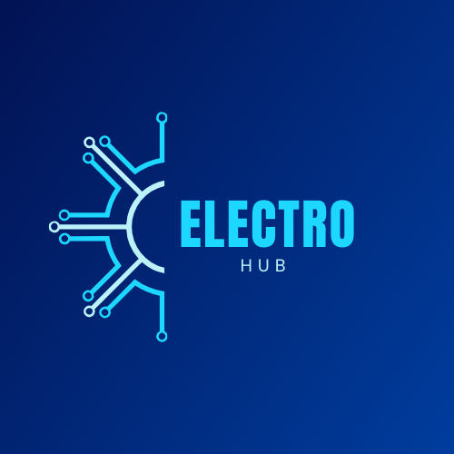
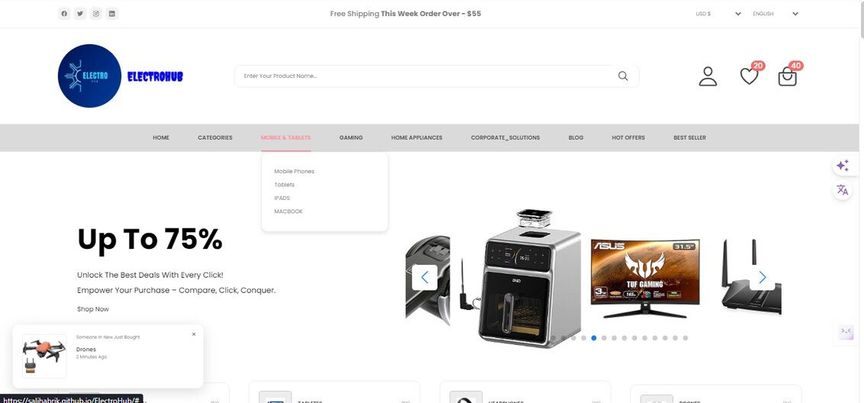
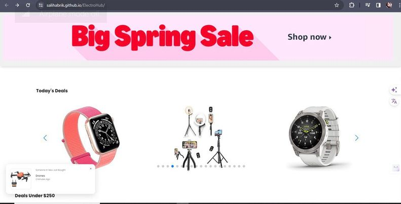
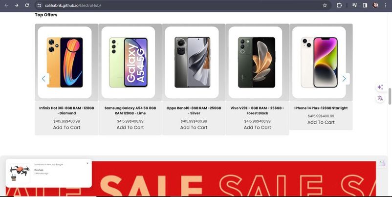
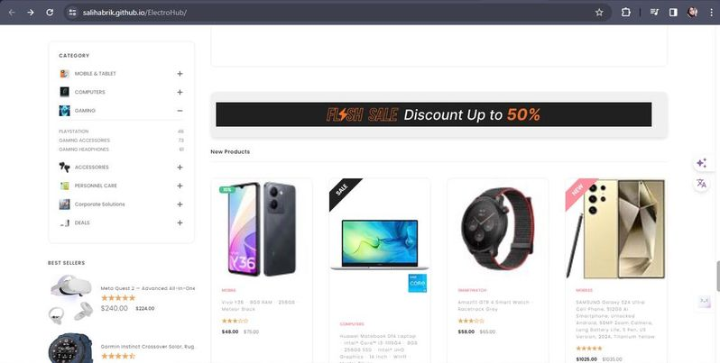
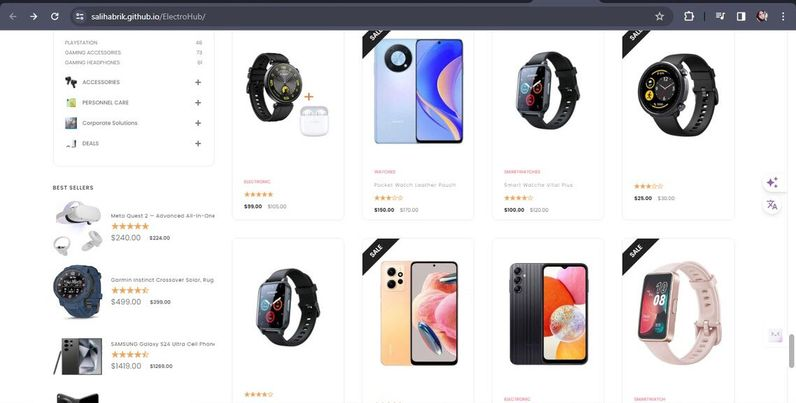
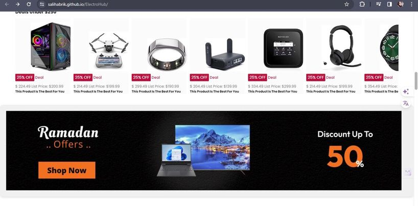
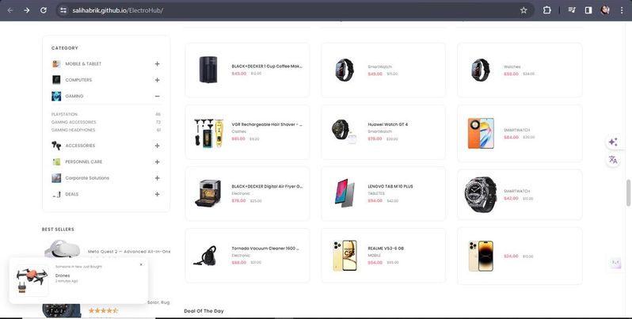
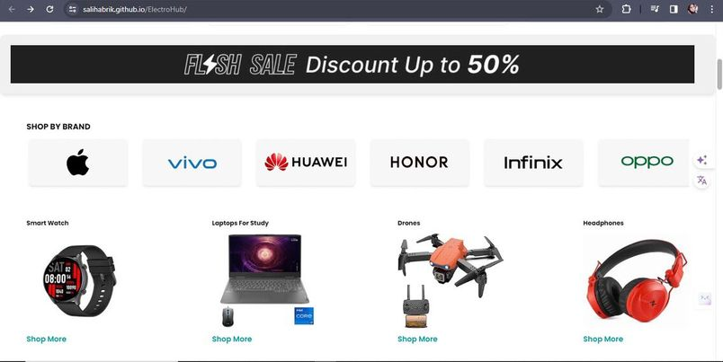

# Digital-Commerce-Charm

Unlock the Best Deals with Every Click!  Empower Your Purchase – Compare, Click, Conquer.

            <a href="https://salihabrik.github.io/Digital-Commerce-Charm-/" class="btn">shop now</a>

## Welcome to ElectroHub

## Welcome to ElectroHub, an innovative online marketplace where technology meets convenience. ElectroHub is a dynamic eCommerce platform meticulously crafted with cutting-edge technologies such as Node.js, React, and MongoDB. Our mission is to provide tech enthusiasts with a seamless and enjoyable shopping experience, offering a wide range of electronic gadgets and accessories. From smartphones to smart home devices, our platform caters to every digital need. ElectroHub is more than just a marketplace; it's a hub for tech enthusiasts to explore, discover, and indulge in the latest innovations. Join us on this electrifying journey and experience the future of online shopping.

## Project Overview:

"Digital-Commerce-Charm" is a project aimed at developing a comprehensive e-commerce platform, providing an excellent shopping experience for users. The project encompasses multiple objectives, including delivering an outstanding user experience, offering a wide range of products, ensuring a safe and secure shopping experience, achieving operational efficiency, and future platform expansion.

This project was developed as part of my <a href="https://www.alxafrica.com/" target="_blank">ALX</a> final projcet

 ElectroHub is an online marketplace for electronic devices. ElectroHub offers a wide range of smartphones, smart home devices, and other electronic accessories. We strive to provide a seamless and enjoyable shopping experience for tech enthusiasts.

## Website Screenshots:

| Today Deals                                     | Top Offers                                       |
| ------------------------------------------------- | ------------------------------------------------- |
|  |  |

|  |  |  |
|---------------------------------|---------------------------------|---------------------------------|
| Shop More                      | New Products                    | Best Sellers                    |

|  |  |

## Video Demo:

## Team Members:

1. **Ibrahim ABOUELENIN:** Frontend and Backend Developer.  
   - GitHub: [ibrahimabouelenin](https://github.com/Blackhat-red-team)
   - LinkedIn: [Ibrahim ABOUELENIN](https://www.linkedin.com/in/ibrahimabouelenin/)

2. **Abdulla Ahmed:** Frontend and Backend Developer.  
   - GitHub: [abdullaahmed](https://github.com/abdullaahmed)
   - LinkedIn: [Abdulla Ahmed](https://www.linkedin.com/in/abdullaahmed/)

3. **Saliha Brik:** Frontend and Backend Developer.  
   - GitHub: [salihabrik](https://github.com/salihabrik)
   - LinkedIn: [Saliha Brik](https://www.linkedin.com/in/salihabrik/)

## Technologies Used:

1. **Frontend Technologies:**
2. 
   - 
   - 
   - 
   - 

2. **Backend Technologies:**
3. 
   - 
   - 
   - 
   - 

4. **Other Tools and Services:**
5. 
   -  and 
   - 
   - 
   - 

## Development Report:
#### Achievements:
1. Successfully developed the main user interface, achieving an attractive and user-friendly design.
2. Implemented user management system and login functionality successfully, providing a personalized shopping experience for registered users.
3. Developed secure and reliable payment systems, ensuring ease and security of purchase transactions across the platform.

#### Challenges:
1. Faced challenges in integrating the frontend with the backend of the project.
2. The main challenge lies in implementing advanced features such as delivery tracking, requiring complex technical solutions and comprehensive testing.
3. Inventory and order management processes need improvements to increase operational efficiency and enhance the end-user experience.

#### Areas for Improvement:
1. Improve website performance and enhance user experience by optimizing responsiveness and loading speed.
2. Enhance payment experience and expand available payment options for users.
3. Improve inventory and order management processes to increase operational efficiency.

#### Lessons Learned:
1. Importance of thorough planning before execution to avoid issues and effectively achieve goals.
2. Importance of continuous communication within the team and providing feedback to increase productivity and improve quality.
3. Necessity of adapting to changing customer requirements continuously to meet their needs and expectations.

#### Next Steps:
1. Continue to improve and develop the platform based on feedback from users and the team.
2. Expand features and functionalities to meet the evolving market needs and enhance user experience.
3. Enhance security and stability through improvements in security and continuous quality testing.

## Conclusion:
With this, we have presented our overview of the "Digital-Commerce-Charm" project. Thank you for your time and attention, and we look forward to any questions you may have.

